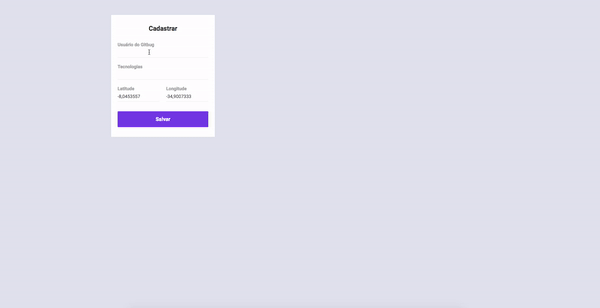

<h1 align="center"></h1>

<div align="center">

     

   [Backend](#Backend) | [Frontend](#Frontend)

</div>

<h3>
    Project to connect developers that live near each other and use the same technologies. The web application of DevRadar is responsible for the registration of developers. 
</h3>

<p align="center">
    
</p>

## Prerequisites

- yarn
- node

## Backend

The application's backend was developed in NodeJS using MongoDB as the database.

### Start

1. Go to the *backend* folder
2. Install dependencies:
    ```
    yarn
    ```
3. Run project: 
    ```
    yarn start
    ```

## Frontend

The application's frontend was developed in ReactJS.

### Start

1. Go to the *frontend* folder
2. Install dependencies:
    ```
    yarn
    ```
3. Run application: 
    ```
    yarn start
    ```

### Screen

<p align="center">
    
</p>

<div align="center">
  <sub>This project was developed during the OmniStack 10 Week by
  <a href="https://rocketseat.com.br/">Rocketseat</a>
</div>